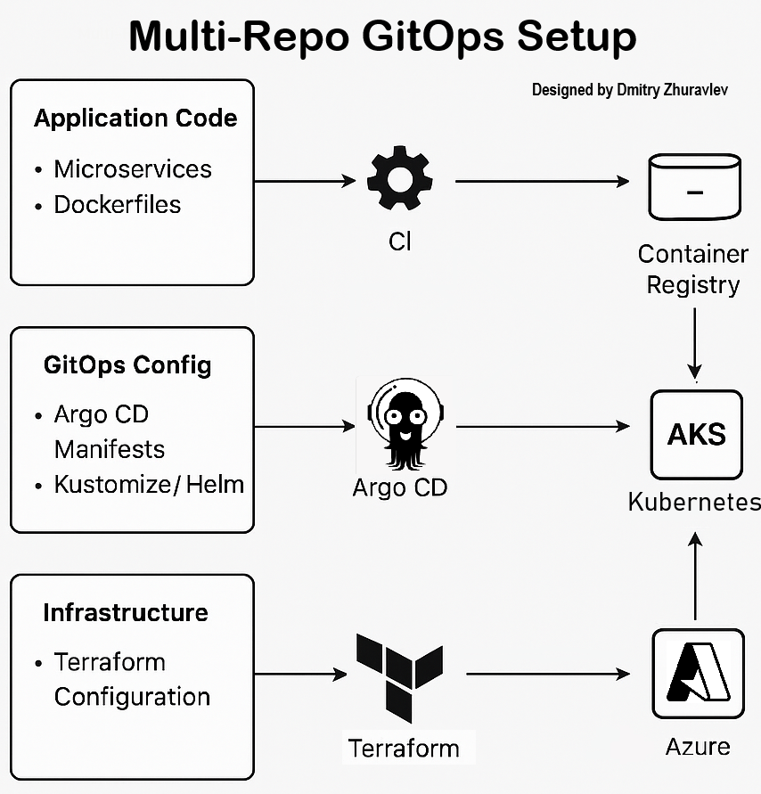

# GitOps Deployment with Argo CD on Azure Kubernetes Service (AKS)

This repository is part of a **Multi-Repo GitOps Architecture** that automates the deployment of the **Online Boutique microservices demo** into **Azure Kubernetes Service (AKS)** using **Argo CD**.

## Part 1: Multi-Repo GitOps Setup with Argo CD

###  GitOps Architecture Overview

This setup follows a **Multi-Repo GitOps model** based on Argo CD, which promotes separation of concerns across three repositories:

| Repository Name               | Purpose                                              | GitHub Link                                                                 |
|------------------------------|------------------------------------------------------|------------------------------------------------------------------------------|
| `azure-argocd-online-shop`   | Argo CD GitOps configuration (this repo)             | [azure-argocd-online-shop](https://github.com/DimitryZH/azure-argocd-online-shop) |
| `azure-terraform-online-shop`| Terraform-based provisioning of Azure infrastructure | [azure-terraform--online-shop](https://github.com/DimitryZH/azure-terraform-online-shop) |
| `microservices-demo`         | Microservices application code                       | [microservices-demo](https://github.com/DimitryZH/microservices-demo)       |


###  Key Benefits

- **Separation of Duties:** Code, infra, and deployment are decoupled.
- **Secure & Auditable:** Sensitive values handled via secure channels.
- **Declarative & Reproducible:** Source-controlled definitions for infra and workloads.
- **Scalable & Maintainable:** New environments/apps are easily added with the App of Apps pattern.


###  Architecture Diagram

The following diagram represents the interaction between these components:



- **Argo CD** is installed inside the AKS cluster.
- It continuously monitors this GitOps repo for application deployment definitions.
- Application code is pulled from a separate repo into the cluster via Kubernetes manifests.
- Container images are stored in Docker Hub, built separately.
- Infrastructure like AKS is provisioned via Terraform.


## Part 2: `azure-argocd-online-shop/` – Argo CD GitOps Repository

This repository holds Argo CD configurations using the **App of Apps** pattern to deploy the Online Boutique app to AKS.

###  Repository Structure

```bash
azure-argocd-online-shop/
├── apps/
│   ├── boutique-kustomize.yaml        # Argo CD Application for microservices demo
│   └── kustomization.yaml             # Kustomize entrypoint
├── projects/
│   └── online-boutique-project.yaml   # Argo CD App of Apps root project
└── assets/
    ├── gitops-architecture-diagram.png
    └── argocd-ui-screenshot.png       
