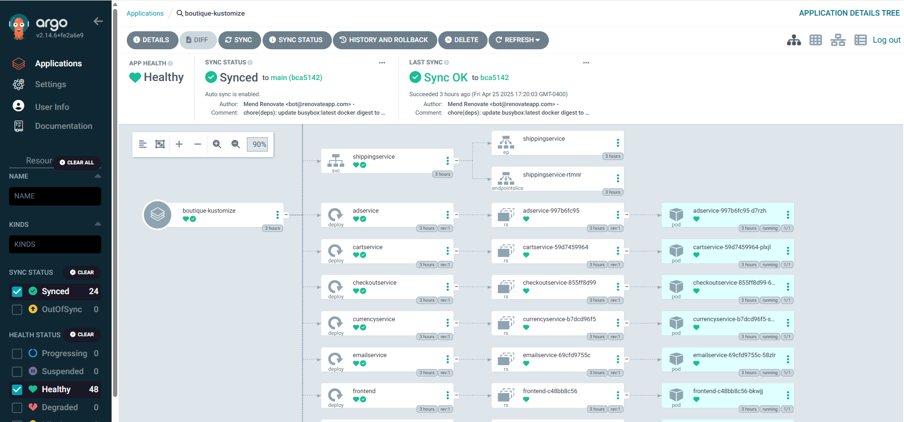

# GitOps Deployment with Argo CD on Azure Kubernetes Service (AKS)

This repository is part of a **Multi-Repo GitOps Architecture** that automates the deployment of the **Online Boutique microservices demo** into **Azure Kubernetes Service (AKS)** using **Argo CD**.

## Part 1: Multi-Repo GitOps Setup with Argo CD

###  GitOps Architecture Overview

This setup follows a **Multi-Repo GitOps model** based on Argo CD, which promotes separation of concerns across three repositories:

| Repository Name               | Purpose                                              | GitHub Link                                                                 |
|------------------------------|------------------------------------------------------|------------------------------------------------------------------------------|
| `azure-argocd-online-shop`   | Argo CD GitOps configuration (this repo)             | [azure-argocd-online-shop](https://github.com/DimitryZH/azure-argocd-online-shop) |
| `azure-terraform-online-shop`| Terraform-based provisioning of Azure infrastructure | [azure-terraform--online-shop](https://github.com/DimitryZH/azure-terraform-online-shop) |
| `microservices-demo`         | Microservices application code                       | [microservices-demo](https://github.com/DimitryZH/microservices-demo)       |


###  Key Benefits

- **Separation of Duties:** Code, infra, and deployment are decoupled.
- **Secure & Auditable:** Sensitive values handled via secure channels.
- **Declarative & Reproducible:** Source-controlled definitions for infra and workloads.
- **Scalable & Maintainable:** New environments/apps are easily added with the App of Apps pattern.


###  Architecture Diagram

The following diagram represents the interaction between these components:


- **Argo CD** is installed inside the AKS cluster.
- It continuously monitors this GitOps repo for application deployment definitions.
- Application code is pulled from a separate repo into the cluster via Kubernetes manifests.
- Container images are stored in Docker Hub, built separately.
- Infrastructure like AKS is provisioned via Terraform.


## Part 2: `azure-argocd-online-shop/` – Argo CD GitOps Repository

This repository holds Argo CD configurations using the **App of Apps** pattern to deploy the Online Boutique app to AKS.

###  Repository Structure

```bash
azure-argocd-online-shop/
├── apps/
│   ├── boutique-kustomize.yaml        # Argo CD Application for microservices demo
│   └── kustomization.yaml             # Kustomize entrypoint
├── projects/
│   └── online-boutique-project.yaml   # Argo CD App of Apps root project
└── assets/
    ├── gitops-architecture-diagram.png
    └── argocd-ui-screenshot.png       
```
 ###  Argo CD Installation

```bash
 kubectl create namespace argocd
kubectl apply -n argocd \
  -f https://raw.githubusercontent.com/argoproj/argo-cd/stable/manifests/install.yaml
```

### Access Argo CD UI
```bash
kubectl port-forward svc/argocd-server -n argocd 8080:443
```
Default credentials:
```bash
username: admin
password: $(kubectl get secret argocd-initial-admin-secret -n argocd -o jsonpath="{.data.password}" | base64 -d)
```
###  Deploy App of Apps (bootstrap Argo CD)
```bash
kubectl apply -f projects/online-boutique-project.yaml -n argocd
```
This triggers deployment of all defined child applications under apps/.

### Argo CD UI Preview
Below is a snapshot of Argo CD’s web UI showing the deployed applications.


The `online-boutique-project` contains the `boutique-kustomize` child application.

Sync status and health are automatically displayed.

Each change in this repo gets reflected in AKS through continuous sync.



### Results
Once all resources are provisioned via Terraform and apps are synced via Argo CD:

- Microservices are deployed to AKS.

- Argo CD provides continuous delivery with full visibility.

### Conclusions

This GitOps setup is:

- Modular: Clean separation of infrastructure, code, and deployment logic.

- Production-ready: Supports secure secrets management and GitOps workflows.

- Scalable: Easily extendable for more apps, environments, or clusters.

For future enhancements, consider integrating:

- Azure Key Vault for secure secret injection

- Automated CI pipelines for building and pushing images to ACR