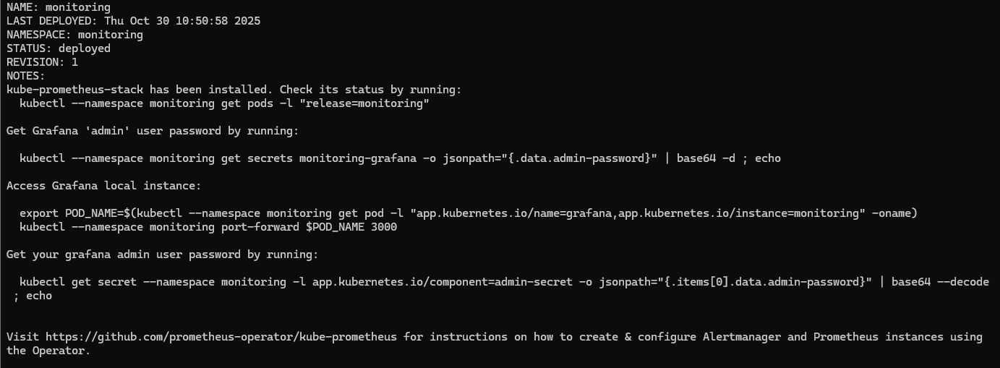
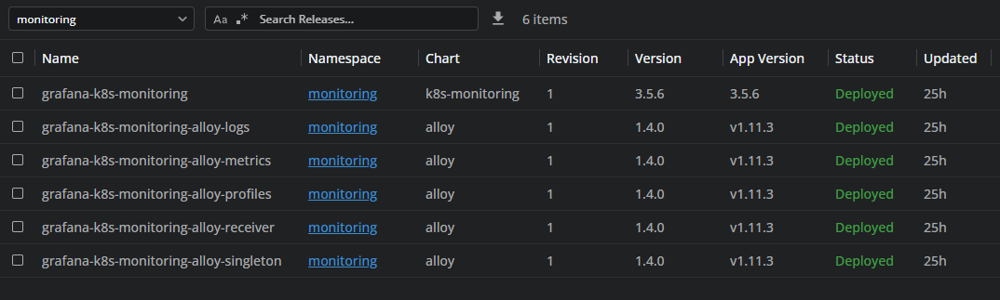
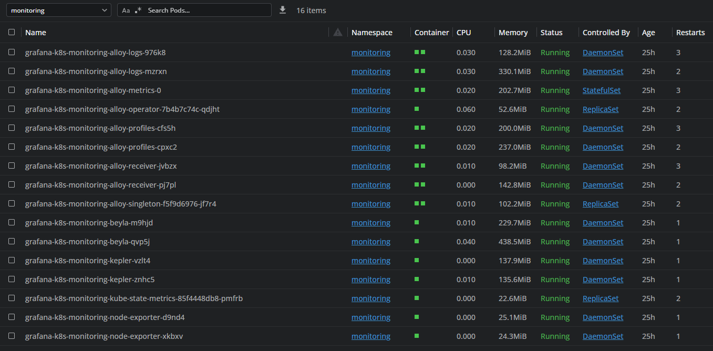
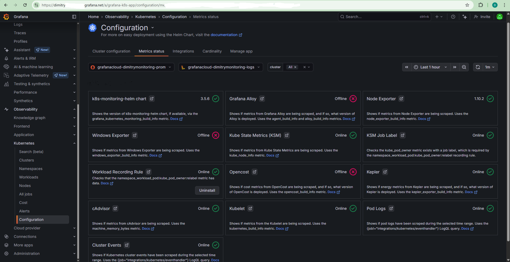

# Observability — Kubernetes Monitoring (Grafana Cloud k8s-monitoring v3.5.6)

This document summarizes the Kubernetes monitoring components deployed in the cluster using the Grafana Cloud Kubernetes Monitoring stack (Helm chart v3.5.6). It aims to be a clear reference for operators and SREs.

## Table of contents

- [Prerequisites](#prerequisites)
- [Install / Upgrade (Helm)](#install--upgrade-helm)
- [Status summary](#status-summary)
  - [Online components](#online-components)
  - [Offline / optional components](#offline--optional-components)
- [Deployed components & details](#deployed-components--details)
- [Recommendations & maintenance notes](#recommendations--maintenance-notes)
- [Quick reference table](#quick-reference-table)

---

## Prerequisites

- Grafana Cloud Kubernetes Monitoring v2 (Helm chart 3.5.6)
- A `values.yaml` exported from your Grafana Cloud stack (or customized values file)

## Install / Upgrade (Helm)

Add the Grafana Helm repo, update, then install/upgrade the k8s-monitoring chart. Example:

```powershell
helm repo add grafana https://grafana.github.io/helm-charts
helm repo update
helm upgrade --install --atomic --timeout 300s grafana-k8s-monitoring grafana/k8s-monitoring `\`
  --namespace "grafana" --create-namespace --values values.yaml
```

To enable OpenCost (optional):

```powershell
helm upgrade grafana-k8s-monitoring grafana/k8s-monitoring `\
  -n monitoring `\
  -f current-values.yaml `\
  --set opencost.enabled=true
```

### Example: Helm install output

Below is a sample CLI output after installing revision 1 of the monitoring Helm chart.  


This output confirms successful deployment of the Grafana Cloud Kubernetes Monitoring stack and provides a reference for expected installation logs.

### Monitoring namespace — Helm releases (Lens)

Below is a sample screenshot from Lens showing Helm releases deployed in the `monitoring` namespace.



Use this view to quickly verify installed release names (for example: `grafana-k8s-monitoring`, `opencost`) and their namespaces/versions. Actual release names and versions may vary depending on your chart values and install target (`monitoring` vs `grafana`).

### Monitoring namespace — sample containers (Lens)

Below is a sample screenshot from Lens showing containers deployed in the `monitoring` namespace.



Use this view to quickly verify expected container names and counts (for example: alloy-*, node-exporter, kube-state-metrics, kepler, loki). Actual pod names and replica counts may vary depending on chart values and whether you installed into `monitoring` or `grafana` namespace.

---

## Status summary

Below is a concise summary of the monitoring components and their roles deployed in your Kubernetes cluster via Grafana Cloud k8s-monitoring v3.5.6. 

Review the status of deployed components in Grafana Cloud by navigating to your Stack Overview:
- Home
- Observability
- Kubernetes 
- Configuration
- Metrics Status tab

A screenshot showing component status (online/offline) and health can be found here:


The Metrics status view helps verify which collectors are active and sending data to Grafana Cloud. Refer to the detailed component sections below for expected status of each component.


### Online components

- **k8s-monitoring Helm chart** (v3.5.6) — Status: Online
  - Purpose: Manages deployment of monitoring components
  - Metric: `grafana_kubernetes_monitoring_build_info`

- **Kube State Metrics (KSM)** — Status: Online
  - Purpose: Exposes Kubernetes object state and metadata
  - Metric: `kube_node_info`

- **Node Exporter** (v1.10.2) — Status: Online
  - Purpose: Hardware and OS metrics from Linux nodes
  - Metric: `node_exporter_build_info`

- **cAdvisor** (built into Kubelet) — Status: Online
  - Purpose: Container-level resource usage
  - Metric example: `machine_memory_bytes`

- **Kubelet** — Status: Online
  - Purpose: Node agent; pod/container statistics
  - Metric: `kubernetes_build_info`

- **Kepler** — Status: Online
  - Purpose: Energy consumption / sustainability metrics
  - Metric: `kepler_exporter_build_info`

- **Pod logs** — Status: Online (backend: Grafana Loki)
  - Query example to collect: `{job!="integrations/kubernetes/eventhandler"}`

- **Cluster events** — Status: Online (enabled during setup)
  - Query example: `{job="integrations/kubernetes/eventhandler"}`
  - Component: Alloy Singleton pod handles cluster-wide tasks

- **KSM job labels & Workload recording rule** — Status: Online
  - Purpose: Ensure recording rules and pod→workload mapping function efficiently
  - Recording rule (created in Grafana Cloud): `namespace_workload_pod:kube_pod_owner:relabel`

### Offline / optional components

- **Grafana Alloy** (detection flagged as Offline) — Actual: Running
  - Note: The metrics status page may indicate Alloy as offline due to different metric names; the Alloy-based stack (alloy-logs, alloy-metrics, alloy-receiver, alloy-singleton) is present and operational.

- **Windows Exporter** — Status: Offline (expected for Linux-only clusters)
  - Only required if you have Windows worker nodes.

- **OpenCost** — Status: Offline (optional)
  - Purpose: Kubernetes cost allocation and FinOps. Enable if cost visibility is required.

---

## Deployed components & details

- 5 Alloy pods (collecting/forwarding telemetry)
- Node Exporter: 1 pod per node
- 1 Kube State Metrics pod
- 1 Kepler pod
- cAdvisor (built into Kubelet)

- Helm chart: `k8s-monitoring` v3.5.6
- Namespace: `monitoring` (or `grafana` depending on your install)
- Architecture: Alloy-based (modern stack)
- Destinations: Grafana Cloud Prometheus (metrics), Grafana Cloud Loki (logs & events)

---

## Recommendations & maintenance notes

- Recording rules are managed in Grafana Cloud (Mimir) rather than locally in the Helm chart — maintain them from Grafana Cloud.
- Alloy agents auto-update configuration from Grafana Cloud.
- Watch Grafana Cloud limits for metrics/log retention.
- Consider enabling OpenCost when you need per-namespace or per-workload cost visibility.

---

## Quick reference table

| Component | Status | Essential | Purpose |
|---|---:|:---:|---|
| Helm Chart (k8s-monitoring) | ✅ v3.5.6 | Yes | Deployment management |
| Kube State Metrics | ✅ Online | Yes | Kubernetes object state |
| Node Exporter | ✅ 1.10.2 | Yes | Hardware/OS metrics |
| cAdvisor | ✅ Online | Yes | Container metrics (via kubelet) |
| Kubelet | ✅ Online | Yes | Pod/runtime metrics |
| Kepler | ✅ Online | Nice-to-have | Energy metrics |
| Pod Logs (Loki) | ✅ Online | Yes | Application logs |
| Cluster Events | ✅ Online | Yes | K8s events |
| Workload Recording Rule | ✅ Online | Yes | Recording rules / performance |
| Grafana Alloy | ⚠️ Reported Offline* | Yes | *Actually running — detection mismatch |
| Windows Exporter | ❌ Offline | No | Only for Windows nodes |
| OpenCost | ❌ Offline | No | Optional cost tracking |

---

Last updated: October 31, 2025


