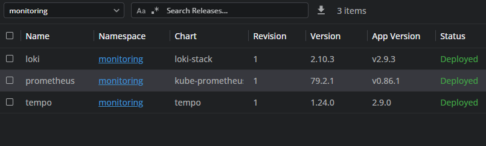
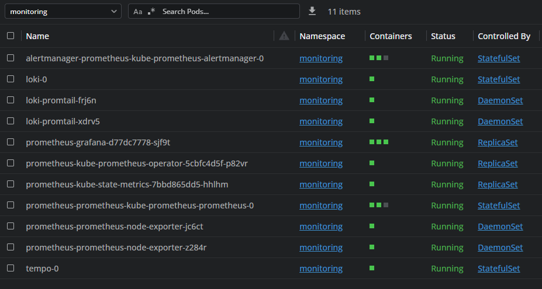
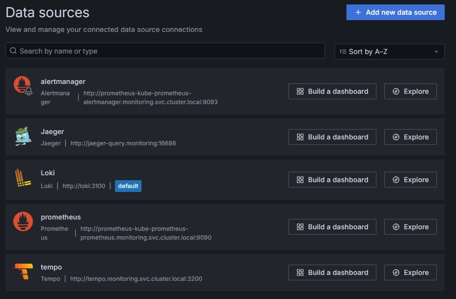

# Local Observability Platform

This repository demonstrates a **local observability platform** setup on Minikube using **Prometheus**, **Grafana**, **Alertmanager**, **Loki**, and **Tempo**. The platform can be used for testing microservices, exploring metrics, logs, and traces in a local Kubernetes environment.

---

##  Components Installed

1. **Prometheus**  
   - Metrics collection and monitoring.
   - Installed via `kube-prometheus-stack` Helm chart.
   - StatefulSet with PersistentVolumeClaim for data retention.

2. **Alertmanager**  
   - Integrated with Prometheus for alerting.
   - Installed as part of `kube-prometheus-stack`.

3. **Grafana**  
   - UI for metrics, logs, and traces.
   - Installed as part of `kube-prometheus-stack`.
   - Configured with DataSources:
     - Prometheus
     - Alertmanager
     - Loki
     - Tempo (optional)

4. **Loki**  
   - Centralized logging system.
   - Installed via `loki` Helm chart.
   - Integrated as a DataSource in Grafana.
   - Promtail deployed to collect logs from Kubernetes pods.

5. **Tempo** (optional)  
   - Distributed tracing system.
   - Installed via `tempo` Helm chart.
   - Integrated as a DataSource in Grafana.
   - Collects traces from applications instrumented with OpenTelemetry.


---

##  Installation Steps


### 1. Add Grafana Helm repository
```bash
helm repo add grafana https://grafana.github.io/helm-charts
helm repo update
```
###  2. Install Prometheus + Grafana + Alertmanager
```bash
helm install prometheus prometheus-community/kube-prometheus-stack  --namespace monitoring --create-namespace -f values.yaml
```

###  3. Install Loki
```bash
helm upgrade --install loki grafana/loki-stack   --namespace monitoring   --set grafana.enabled=false   --set prometheus.enabled=false   --set fluent-bit.enabled=false
```

###  4. Install Tempo (optional)
```bash
helm install tempo grafana/tempo   --namespace monitoring -f values-tempo.yaml
```






---
## Grafana Configuration

DataSources configured:

*   **Prometheus**: `http://prometheus-kube-prometheus-prometheus.monitoring.svc.cluster.local:9090`
*   **Alertmanager**: `http://prometheus-kube-prometheus-alertmanager.monitoring.svc.cluster.local:9093`
*   **Loki**: `http://loki.monitoring.svc.cluster.local:3100`
*   **Tempo**: `http://tempo.monitoring.svc.cluster.local:3200`



---

##  Usage

1.  **Deploy your application in K8S Cluster**
2.  **Ensure logs are collected via  Loki (Promtail) and traces via OpenTelemetry (Tempo).**
3.  **Use Grafana Explore or dashboards to visualize metrics, logs, and traces.**
4.  **Test alerts and dashboard panels in a local development environment.**

---

##  Summary

This setup provides a full-featured observability platform for local development and testing.
It can be used for:

*   Testing microservices
*   Developing dashboards
*   Debugging logs
*   Investigating distributed traces
